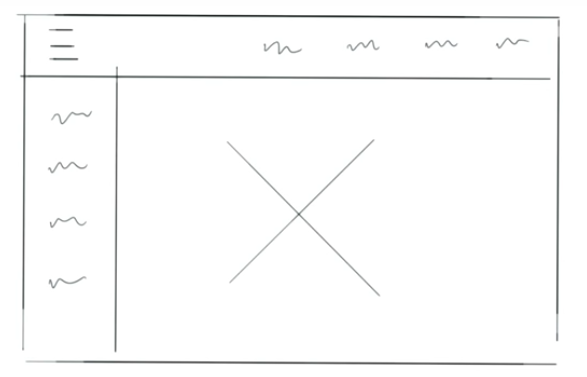

## FOCUS

Determina donde estamos en el documento.

Lo recorremos con `tab` y -> <-

### Tab order

Van de acuerdo a como estan en `html`

[Ejemplo 1](./../examples/focus/after.html)

### DOM order matters

El orden el los elemento de html es importante ya que asi ira el tab en el navegador.

[Ejemplo 2](../examples/focus2/index.html)

### Tabindex

#### tabindex='-1'

- Not in the natural tab order
- Can be programmatically focused with focus() method (with js, for a modal for example)

```js
document.querySelector("#modal").focus();
```

#### tabindex='0'

- In the natural tab order
- Can be programmatically focused (with js, for example in a dropdown)

```html
<div id="dropdown">Settings</div>
```

#### tabindex='5' greater than 0

- In the natural tab order
- Jumped to the front of the tab order
- Anti-pattern! Can be confusing for screen reader users

No todos los elementos deben recibir el foco

### Skip Links

En la siguiente imagen se ve un navbar-top y un navbar-side por lo que el usuario para llegar a "main content" tiene que ir por estas, lo cual es tedioso por ello existen los "skip links"



```html
<a href="#maincontent" class="skip-link">Skip to the main content</a>
<nav id="maincontent"></nav>
```

Esto nos permite movernos al contenido principal

```css
.skip-link {
  position: absolute;
  top: -40px;
  left: 0;
  background: #bf1722;
  color: white;
  padding: 8px;
  z-index: 100;n
}

.skip-link:focus {
    top:0;
}
```

https://webaim.org/techniques/skipnav/

### Components with good practices

https://www.w3.org/TR/wai-aria-practices/

https://www.w3.org/TR/wai-aria-practices-1.1/#radiobutton

### Offscreen Content

Ej. Sidebars, el foco en estos elementos van alli pero visualmente no los podemos ver, esto no es bueno

Nos da la referencia del nodo activo por tab

```js
document.activeElement;
```

https://developer.mozilla.org/en-US/docs/Web/API/Document/activeElement

Una solucion es: `display: none;` o `visibility: hidden;` y cuando le dan click `display: block` o `visibility: visible;`

### Modals and Keyboard traps

Cuando abrimos un modal el foco va a el y cuando termina con sus elementos vueve al del documento inicial y queda atrapado

```js
var focusedElementBeforeModal

var modal = document.querySelecto('.modal')
var modalOverlay = document.querySelecto('.modal-overlay')

var modalToggle = document.querySelectot('.modal-toggle')
modalToggle.addEventListener('click', openModal)

function openModal() {
    // save the current focus
    focusedElementBeforeModal = document.activeElement;
    // listen for and trap the keyboard
    modal.addEventListener('keydown' trapTabKey)
    // listen for indicator to close modal
    modalOverlay.addEventListener('click', closeModal)
    var signUpBtn = modal.querySelector('#signup')
    signUpBtn.addEventListener('click', closeModal)
    // find all focusable children
    var focusableElementString = 'a[href], area[href], input:not([disabled]), select:not([disabled]), iframe, object, embed, [tabindex="0"], [contenteditable]';

    var focusableElements = modal.querySelectorAll(focusableElementString)
    // convert Nodelist to array
    focusableElements = Array.prototype.slice.call(focusableElements)
    var firstTabStop = focusableElements[0]
    var lastTabStop = focusableElements[focusableElements.lengh - 1]
    // show modal and overlay
    modal.style.diplay = 'block'
    modalOverlay.style.display ='block'
    // focus first child
    firstTabStop.focus()

    function trapTabKey(e) {
        // check for Tab press
        if(e.keyCode === 9){
            // shift + Tab
            if(e.shiftKey) {
                if(document.activeElement === firstTabStop) {
                    e.preventDefault()
                   lastTabStop.focus()
                }
            }else{ // TAB
                if(document.activeElement === lastTabStop) {
                    e.preventDefault()
                    firstTabStop.focus()
                }
            }
        }
        // Escape
        if(e.keyCode === 27){
            closeModal()
        }
    }
}

function closeModal(){
    modal.style.display = 'none'
    modalOverlay.style.display ='none'
    // set focus back to element that it before the modal was open
    focusedElementBeforeModal.focus()
}

```
