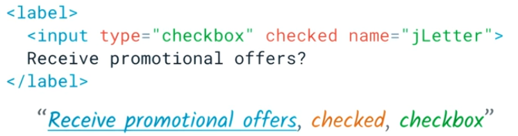

## Semantics Basics

Assitive technology:

- Devices
- Software
- Tools

### Name, Role, Value

- Role: Type of element as: Radio button, Edit text, Combo box, button
- Name: Round trip, Full name, Preferred seat type, Search
- Value:
- State:

### Accesibility tree

Not all element

Cuales elementos trabajan con `label` https://html.spec.whatwg.org/multipage/forms.html#category-label

- visible labels: los botones lo tiene, checkbox
- Text alternative (not visible)

Vinculados por estar en el

Vinculados por su id

### Text alternative

- http://webaim.org/standards/wcag/checklist#sc1.3.2
- http://webaim.org/standards/wcag/checklist#sc2.4.10
- http://webaim.org/standards/wcag/checklist#sc1.3.1
- http://webaim.org/standards/wcag/checklist#sc2.4.1
- http://webaim.org/standards/wcag/checklist#sc2.4.6
