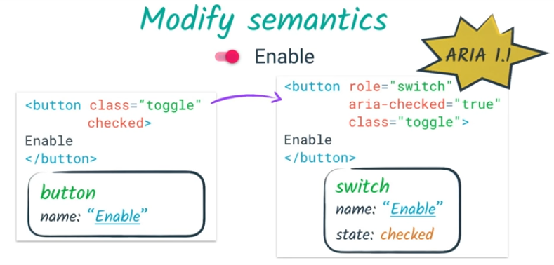
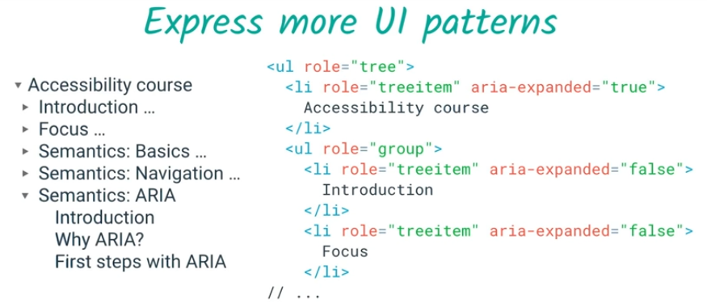
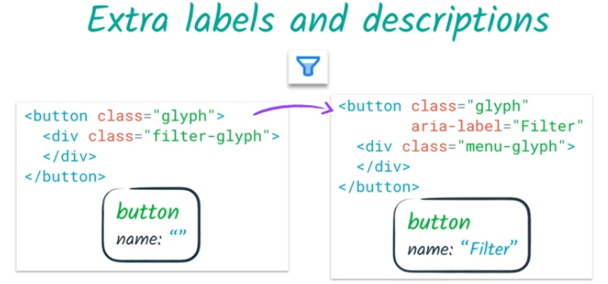
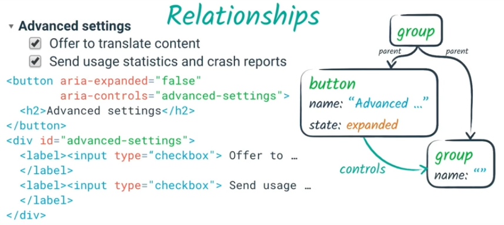
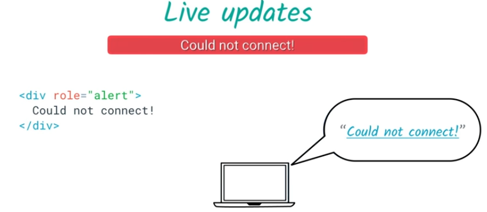
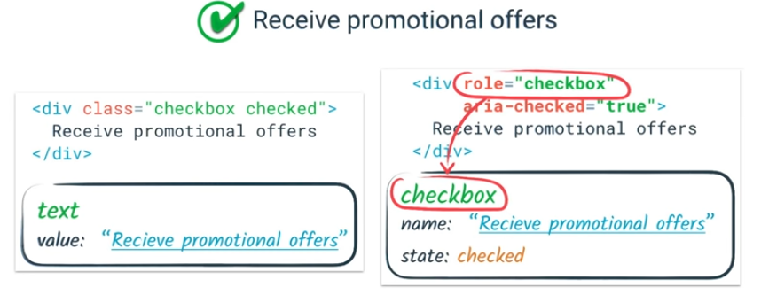

## ARIA

### Why ARIA

Aria puede modicar y convertir un elemento semantico

#### Modify semantics

#### Express more UI patterns

#### Extra labels and descriptions

#### Relationships

#### Live updates

### Roleplaying

- https://www.w3.org/TR/wai-aria-1.0/#roles
- https://www.w3.org/TR/wai-aria-1.1/#roles
- https://www.w3.org/TR/wai-aria-practices-1.1/
