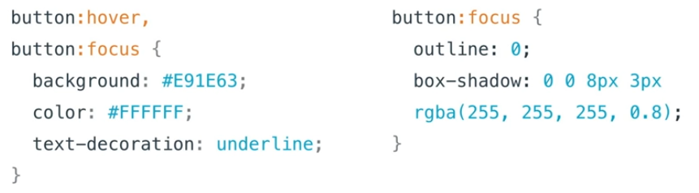
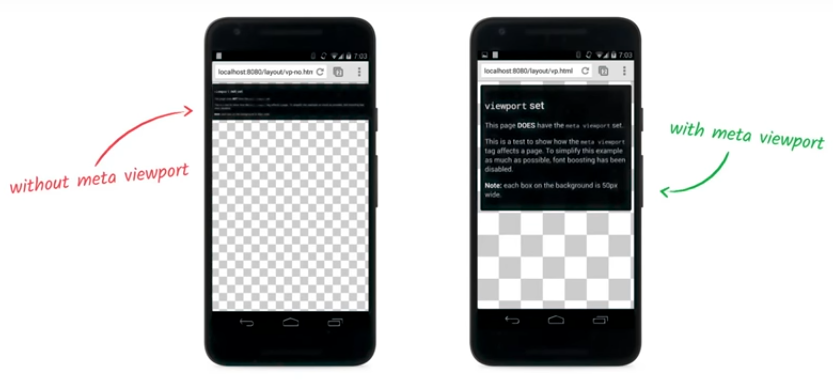

# Style

## Focus styles

- `:focus` pseudo-class
- `outline` CSS property
- `:hover` pseudo-class
- `::before` pseudo-element

Same Hover and Focus styles but we can remove `outline: 0` and add `box-shadow`



## Responsive design for multi-device

http://webaim.org/standards/wcag/checklist#sc1.4.4

```html
<meta name="viewport" content="width=device-width, initial-sacle=1" />
```



## Contrast


- http://webaim.org/standards/wcag/checklist#sc1.4.3
- http://webaim.org/standards/wcag/checklist#sc1.4.6

## Error messages

http://webaim.org/standards/wcag/checklist#sc1.4.1

## High contrast mode

https://chrome.google.com/webstore/detail/high-contrast/djcfdncoelnlbldjfhinnjlhdjlikmph?hl=en
